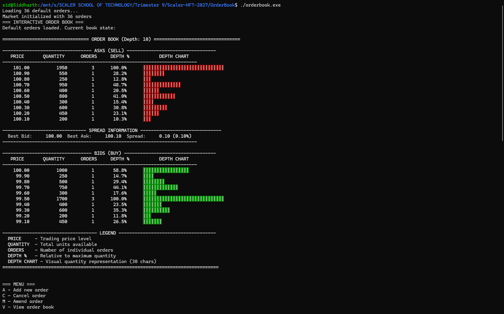
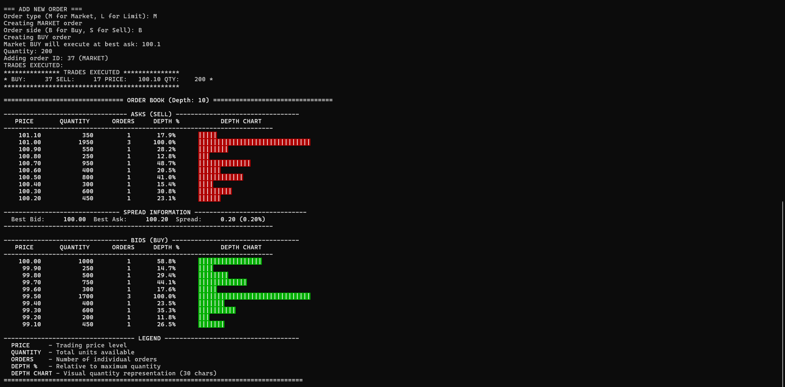
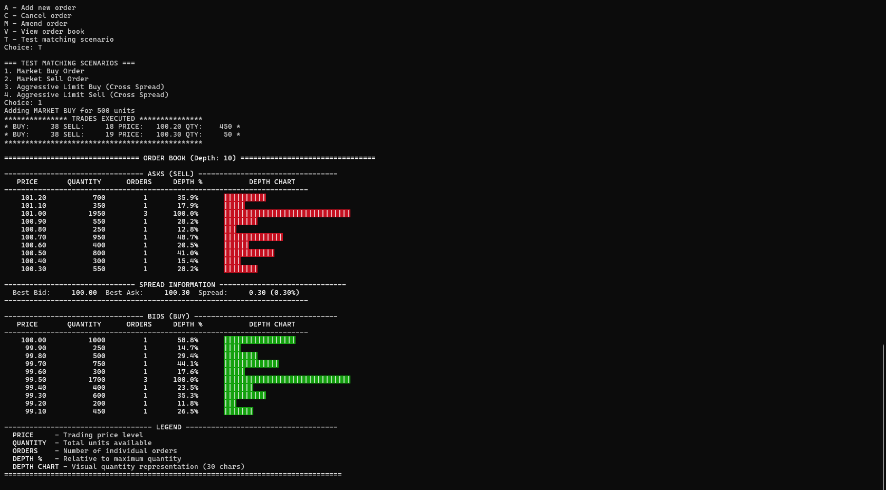
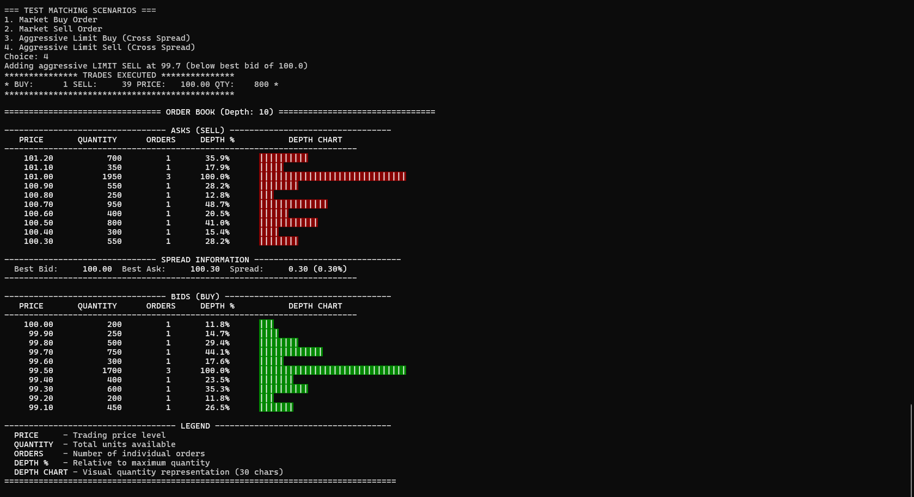

# 📈 C++ Terminal OrderBook

A **high-performance terminal-based Order Book simulator** written in modern **C++**.  
This project models a real-world **order book (Limit/Market)** used by financial exchanges to match buy and sell orders.  
It supports **Limit Orders**, **Market Orders**, and live **trade execution scenarios**, with a clean ASCII-rendered depth chart visualization.

---

## 🚀 Features

- **Limit Orders** – Users can add buy/sell orders at specified price levels.  
- **Market Orders** – Orders that execute immediately at the best available price.  
- **Aggressive Order Handling** – Automatically matches orders that cross the spread.  
- **Order Amend & Cancel** – Modify or remove existing orders.  
- **Trade Matching Engine** – Real-time trade execution simulation between bids and asks.  
- **Depth Visualization** – Displays a depth chart showing liquidity distribution using ASCII bars.  
- **Dynamic Spread Info** – Displays best bid, best ask, and spread percentage.  

---

## 🧠 Order Types Explained

### 1. Limit Order
A limit order specifies a **price and quantity**.  

- A **Limit Buy** executes only if the ask price ≤ your limit price.  
- A **Limit Sell** executes only if the bid price ≥ your limit price.  

Unmatched portions stay in the order book.

### 2. Market Order
Executes **immediately** against the best available prices.  

- A **Market Buy** consumes from the lowest available asks.  
- A **Market Sell** consumes from the highest available bids.  

No price is specified — only quantity matters.

---

## 🧩 Matching Scenarios

You can test the following scenarios from the interactive menu:

- **Market Buy Order** – Buys instantly from best asks.  
- **Market Sell Order** – Sells instantly to best bids.  
- **Aggressive Limit Buy** – Limit buy placed above best ask → triggers trade.  
- **Aggressive Limit Sell** – Limit sell placed below best bid → triggers trade.  

---

## ⚙️ Build and Run

Compile and execute the order book using the following commands:

```bash
g++ -std=c++11 -o orderbook main.cpp order_book.cpp
./orderbook
```


# ScreenShots






=========================
Siddharth R
10076
=========================
